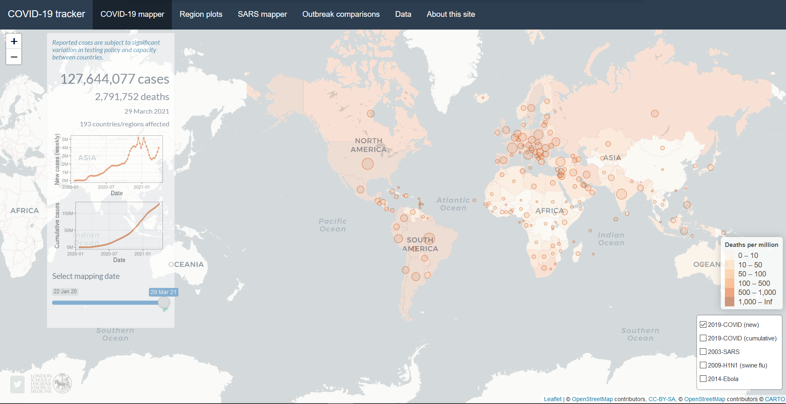

class: inverse, top, center
background-image: url(Archivos/portada.png)
background-size: cover

```{r setup, include=FALSE}
options(htmltools.dir.version = FALSE)
knitr::opts_chunk$set(fig.retina = 3, warning = FALSE, message = FALSE)
```

```{r xaringan-themer, include=FALSE, warning=FALSE}
library(xaringanthemer)
style_duo_accent(
  primary_color = "#c3e89b",
  secondary_color = "#0256B6",
  inverse_header_color = "#FFFFFF",
  header_font_google = google_font("Nunito", "400"),
  text_font_google   = google_font("Roboto", "280", "280i"),
  code_font_google   = google_font("Fira Mono")
)
```

```{r metathis, echo=FALSE}
library(metathis)
meta() %>%
  meta_name("github-repo" = "chechoid/paw21-coding-in-r-live-to-tell") %>% 
  meta_social(
    title = "Coding in R in HR: A Quick Guide to Learning to Code, and Live to Tell the Tale",
    description = paste(
      "This is the presentation for Tucana's People Analytics World 2021 about how to start coding in R and keeping the momemtum going",
      "Developed by Sergio Garcia Mora."
    ),
    url = "https://coding-in-r-in-hr.netlify.app/",
    image = "https://github.com/chechoid/paw21-coding-in-r-live-to-tell/blob/main/Archivos/portada.png",
    image_alt = paste(
      "Coding in R in HR: A Quick Guide to Learning to Code, and Live to Tell the Tale", 
      "Tucana's People Analytics World 2021", 
      "Author: Sergio Garcia Mora"
    ),
    og_type = "website",
    og_author = "Sergio Garcia Mora",
    twitter_card_type = "summary_large_image",
    twitter_creator = "@sergiogarciamor",
    twitter_site = "@data4hr"
  )
```


---
class: inverse, center, middle

#What is R?

---
# What is R?

**R** is an open source language, that was firstly known as a statistical analysis programming language.

--

Nowadays, and thanks to the community of developers who expanded its capabilities, you can use R to do a lot of things.

--

You can work with any kind of data, and make any analysis that you can imagine.

---
class: inverse, center, middle
# What things can you do in R?

---
## Predictive Analytics

.pull-left[
`r emo::ji("crystal")` A well known use case, is to perform *predictive analysis*, for instance to predict Employee's Attrition.

```{r pred1, echo=FALSE}
library(tidyverse)
library(caret) 


# Load data from a github repositary
# Cargo los datos desde un repositorio de github
datos_rh <- read_csv("https://raw.githubusercontent.com/mlambolla/Analytics_HR_Attrition/master/HR_comma_sep.csv")

# Remove 'sales' variable and convert 'salary' into a numeric variable
# Elminamos la variable 'sales' y cambiemos los valores de 'salary' a numéricos.
datos_rh <- datos_rh %>% 
  select(-sales) %>%
  mutate(salary = as.numeric(case_when(
    salary == 'low' ~ 0,
    salary == 'medium' ~ 1,
    salary == 'high' ~ 2
  )))

# Set a seed to reproduce results
# Defino una semilla para poder replicar los resultados
set.seed(234)

# Divide the dataset into training and testing datasets
# Parto el índice para dividir el dataset en training y test
modelo_hr <- createDataPartition(y = datos_rh$left, p = 0.7,
                                 list = FALSE)

# Create training dataframe[row, column]
#Armo el dataframe de training [fila, columna]
modelo_hr_train <- datos_rh[modelo_hr,]

# Using the "-" (minus) we create the testing dataframe  with all the rows 'that are not in modelo_hr'
# Con el signo - (menos), creamos el dataset de testing, con todas las filas 'que no estén en modelo_hr'
modelo_hr_test <- datos_rh[-modelo_hr,]

# Create a model with the training dataframe
# Creamos el modelo con el dataframe de training
modelo_glm2 <- glm(left ~. , family = "binomial",
                   data = modelo_hr_train)

# Train the model estimating probabiliteis with the training dataset
# Entreno el modelo - Calculo las probabilidades en los datos de entrenamiento
pred_train <- predict(modelo_glm2, newdata = modelo_hr_train, type = "response")

# Then use these calculations in the testing dataset
# Luego aplica esos cálculos en el dataset de test
pred_test <- predict(modelo_glm2, newdata = modelo_hr_test, type = "response")

# Asign probabilities to a new column called "score"
# Asigna las probabilidades a una variable nueva llamada "score".
modelo_hr_test$score <- pred_test

# Create a new column base on the "score" column, when score is > 0.5 assign a 1, and if not, set a 0
# Luego en base al score, asigno una clase predicha en función a si la probabilidad es mayor a 0.5
modelo_hr_test <- modelo_hr_test %>% 
  mutate(prediccion = ifelse(score > 0.5, 1, 0))

# Create a confusion matrix
# Creo la matriz de confusión
conf_matrix <- table(modelo_hr_test$prediccion, modelo_hr_test$left)

# Decision trees ----
# Árbol de Decisión

library(rpart)

# Set training and testing datasets
# Creo los datasets de training y de test
arbol_hr_train <- rpart(left ~., data = modelo_hr_train, method = "class")
arbol_hr_test <- predict(arbol_hr_train, newdata = modelo_hr_test)

# Add the model results to the test dataframe
#Agrego los resultados del modelo a los datos de test
modelo_hr_test$score_arbol <- arbol_hr_test[,2]
modelo_hr_test <- modelo_hr_test %>% 
  mutate(prediccion_arbol = ifelse(score_arbol > 0.5, 1, 0))

# Create a confusion matrix
# Creamos la matriz de confusión.
conf_matrix_arbol <- table(modelo_hr_test$prediccion_arbol, modelo_hr_test$left)

```

]
.pull-right[
```{r pred2, echo=FALSE, fig.show='hold'}
library(pROC)

# Plot ROC curves for the logistic regression and the decision tree models
# Grafico las curvas ROC para la regresión logística y el árbol de decisión
rocobj1 <- plot.roc(modelo_hr_test$left, modelo_hr_test$score,
                    main="Curva ROC",percent=TRUE, col="#1c61b6")

rocobj2 <- lines.roc(modelo_hr_test$left, modelo_hr_test$score_arbol,
                     percent=TRUE, col="#008600")

testobj <- roc.test(rocobj1, rocobj2)
legend("bottomright", legend=c("Logistics Regression", "Decision Tree"), 
       col=c("#1c61b6", "#008600"), lwd=2)
```


]
---
## Cluster Analysis

.pull-left[

```{r clus1, echo = FALSE}
# Scatter Plot of Satisfaction and Performance Levels
ggplot(datos_rh, aes(x = last_evaluation, y = satisfaction_level, color = factor(left)))+
  geom_point(alpha = 0.8)+
  scale_color_manual(values = c("#BFC9CA","#2874A6"))+
  labs(title = "Performance and Satisfaction Levels",
       subtitle = "0 = Current Employee, 1 = Left",
       x= "Performance",
       y= "Satisfaction",
       color = "Employee \n Status")
```
]

--

.pull-right[
```{r clus2, echo=FALSE}
# Seleccionamos las variables para elegir los clusters
variables_cluster <- modelo_hr_test %>%
  select(last_evaluation, satisfaction_level)

# Preparo los datos para hacer el cálculo
vc <- scale(variables_cluster)

# Corro el algoritmo de clustering k-means  
fit_vc <- kmeans(vc, 3)

# Agrego los clusters ajustados (calculados) al dataset
modelo_hr_test$cluster <- fit_vc$cluster

library(ggthemes)

# Gráfico de clusters
ggplot(modelo_hr_test, aes(x = last_evaluation, y = satisfaction_level, color = factor(cluster)))+
  geom_point(alpha = 0.8)+
  scale_color_colorblind()+
  labs(title = "Employee Clusters by Performance and Satisfaction",
       subtitle = "Clusters defined with k-means algorithm",
       x= "Performance",
       y= "Satisfaction",
       color = "Cluster") +
  theme_light()
```

]
---
## Organizational Network Analysis

.pull-left[
```{r ona, echo=FALSE}
library(igraph)
library(readr)
library(visNetwork)
library(networkD3)


#### Datos ####

contactos <- read_delim("data/contactos.csv", delim = ";")

data_scientist <- contactos %>% 
  filter(str_detect(Position, "data.scientist")|str_detect(Position, "data.analyst|analytics"))


origen <- data_scientist %>% 
  distinct(Origen) %>% 
  rename(label=Origen)

contacto <- data_scientist %>% 
  distinct(nombre_apellido) %>% 
  rename(label=nombre_apellido)

nodes <- full_join(origen, contacto, by = "label")

nodes <- nodes %>% rowid_to_column("id")

conexion <- data_scientist %>% 
  group_by(Origen, nombre_apellido) %>% 
  summarise(peso = n()) %>% 
  ungroup()

aristas <- conexion %>% 
  left_join(nodes, by = c("Origen" = "label")) %>% 
  rename(from = id)

aristas <- aristas %>% 
  left_join(nodes, by = c("nombre_apellido" = "label")) %>% 
  rename(to = id)


aristas <- select(aristas, from, to, peso)


edges <- mutate(aristas, width = peso/5 + 1)

nodes$color <- c(rep("#DD6B06", 3), rep("#2CAFBB", 261))


referidos <- visNetwork(nodes, aristas) %>% 
  visIgraphLayout(layout = "layout_with_fr") %>% 
    visNodes(color = list(background = "#5DBAC3",
                        border = "#01636D")) %>% 
  visEdges(color = list(color = "grey", highlight = "#014D54" )) %>% 
  visOptions(highlightNearest = TRUE)

referidos

```

]

.pull-right[

We can use graph analysis to carry out Organizational Network Analysis.

In this simple example we are analyzing LinkedIn's connections of 3 People Analytics, to find out Data Scientists they have in common for a referral program. `r emo::ji("exploding_head")`

]

---
## Text Mining

You can analyze text in surveys, resumes, opinions in sites like Glassdoor and so on. This is an analysis on a Home Office survey from last year.

.pull-left[
```{r tm1, echo=FALSE, out.width="70%"}
library(reshape2)
library(googlesheets4)
library(gargle)

EncuestaHomeOffice <- sheets_read("1g2q3c_MMrBc4MehO4Yjktpu2fk7s7M8Bn2wIgV6yQHo")


EncuestaHomeOffice <- EncuestaHomeOffice %>% 
  select("¿Creés que va a cambiar la forma de trabajar después de esta crisis?",
         "Justifica la respuesta")

#### Limpieza de Datos ####

# Cambio los nombres de las variables para hacerlo más manejable
hos <- EncuestaHomeOffice %>%
  rename("Cambios_Futuros" = "¿Creés que va a cambiar la forma de trabajar después de esta crisis?",
         "Comentarios" = "Justifica la respuesta")

# Text Mining 
# Fuente: http://www.aic.uva.es/cuentapalabras/palabras-vacias.html

library(tidytext)
library(wordcloud2)


zx <- theme(panel.background = element_blank(),
            panel.grid.major.x = element_line(colour = "#F4F6F6"),
            axis.line = element_line(colour = "grey"))


eho_text <- hos %>%
  select(Cambios_Futuros, Comentarios) %>%
  filter(!is.na(Comentarios)) %>%
  mutate(Comentarios = as.character(Comentarios))

eho_text_pal <- eho_text %>%
  unnest_tokens(palabra, Comentarios)


# Un lexicon más exhaustivo y detallado
vacias <- read_csv("https://raw.githubusercontent.com/7PartidasDigital/AnaText/master/datos/diccionarios/vacias.txt",
                   locale = default_locale())


# Hacer un anti_join para eliminar las palabras del corpus que están en el listado del lexicon
eho_text_vacio <- eho_text_pal %>%
  anti_join(vacias)


# Si quiero armar un listado específico de palabras para eliminar del análisis, luego uso un anti_join
vacias_adhoc <- tibble(palabra = c("trabajo", "home", "office", "van", "va"))

# Hay varias palabras que se repiten y que no aportan mucho valor así que las elimino.
eho_text_vacio <- eho_text_vacio %>%
  anti_join(vacias_adhoc)

# Ordeno los comentarios en base a la variable "Cambios_Futuros"
library(forcats)

eho_text_vacio$Cambios_Futuros <- fct_relevel(eho_text_vacio$Cambios_Futuros, "Sí", "Tal vez", "No")

# Lexicon de sentimientos
sentimientos <- read_tsv("https://raw.githubusercontent.com/7PartidasDigital/AnaText/master/datos/diccionarios/sentimientos_2.txt",
                         col_types = "cccn",
                         locale = default_locale())

# Modificación de la función get_sentiments de tidyverse
source("https://raw.githubusercontent.com/7PartidasDigital/R-LINHD-18/master/get_sentiments.R")

## Análisis General
eho_text_nrc <- eho_text_vacio %>%
  right_join(get_sentiments("nrc")) %>%
  filter(!is.na(sentimiento)) %>%
  count(sentimiento, sort = TRUE)


feelings <- c("negativo", "positivo", "negativo", "negativo", "negativo", "positivo", "positivo", "positivo")

eho_text_nrc %>%
  filter(sentimiento != "negativo", sentimiento !="positivo") %>%
  cbind(feelings) %>%
  ggplot(aes(reorder(sentimiento, n), n, fill = feelings)) +
  geom_bar(stat = "identity", show.legend = FALSE) +
  scale_fill_manual(values = c("#F5B041","#5DADE2"))+
  zx +
  coord_flip() +
  labs(title="Sentiment Analysis",
       caption = "Source: Home Office Survey 2020",
       x = "Sentiment",
       y = "Times")


```
]

.pull-right[
```{r tm2, echo=FALSE, out.width="75%"}
library(wordcloud2)
library(webshot)

eho_text_vacio %>%
  filter(Cambios_Futuros == "Sí") %>%
  count(palabra, sort = TRUE) %>%
  filter(n >=3) %>% 
  ungroup() %>%
  wordcloud2( size = 0.6, color = rep_len(c("#4445f8", "#7563fa", "#9881fc", "#b59ffe"), nrow(.)))


```

]

---
## Interactive applications in Shiny

.left-column[

]

.right-column[
**Shiny** allows you to build interactive applications that makes data users interact, navigate and explore data, to find their own insights.

You can check this example by [Edward Parker](https://www.lshtm.ac.uk/aboutus/people/parker.edward) and his [Covid-19 Tracker](https://vac-lshtm.shinyapps.io/ncov_tracker/?_ga=2.199884654.193509739.1617140093-220020266.1617140093).


]

---
## Plots

You can make any kind of plot in R.

```{r plot1, echo=FALSE, fig.show='hold', out.width="33%"}
library(hrbrthemes) # Agrega estilos predefinidos y paletas de colores
library(ggeconodist)
library(ggthemes)
library(lubridate)
library(scales)

# Plot 1
hr_data <- read_delim("data/HRDataset_v13.csv", delim = ";")

perf_by_source <- hr_data %>% 
  select(RecruitmentSource, PerfScoreID) %>% 
  group_by(RecruitmentSource) %>% 
  summarise(performance_promedio = mean(PerfScoreID)) %>% 
  arrange(-performance_promedio)

ggplot(perf_by_source, aes(x=performance_promedio, 
                           y = reorder(RecruitmentSource, performance_promedio))) +
  geom_point(color = ft_cols$yellow, size = 2) +
  labs(title="Average Performance by Recruitment Source", # Divide el titulo en dos renglones
       y="",
       x="Average Performance Rating")+
  theme_ft_rc()+
  theme(plot.title = element_text(hjust = 1))

# Plot 2

expectativas_laborales <- gs4_get("1HeFbgf0aubb5HBSFJTRzGCpW536O1cji7I6lgiNqvqg") %>%
  read_sheet()

exp_lab <- expectativas_laborales%>%
  rename(Expectativa = Período) %>%
  pivot_longer(-Expectativa, names_to = "Periodo", values_to = "Valor") %>%
  mutate(Periodo = dmy(Periodo),
         Trimestre = quarter(Periodo, with_year = TRUE, fiscal_start = 1),
         Expectativa = factor(Expectativa, levels = c("La dotación aumentará",
                                                      "La dotación disminuirá",
                                                      "La dotación se mantendrá"),
                              labels = c("Aumentará", "Disminuirá", "Sin Cambios"))) %>%
  filter(Trimestre > 2013.04) %>%
  group_by(Trimestre) %>%
  summarise(Exp_Aumento = mean(Valor[Expectativa== "Aumentará"]),
            Exp_Disminuye = mean(Valor[Expectativa== "Disminuirá"]),
            Exp_Igual = mean(Valor[Expectativa == "Sin Cambios"]))

exp_empresaria <- exp_lab %>%
  pivot_longer(-Trimestre, names_to = "Expectativa", values_to = "Valor") %>%
  mutate(Expectativa = factor(Expectativa, levels = c("Exp_Aumento",
                                                      "Exp_Disminuye",
                                                      "Exp_Igual"),
                              labels = c("Aumentará", "Disminuirá", "Sin Cambios"))) %>% 
  filter(Expectativa != "Sin Cambios")


ggplot(exp_empresaria, aes(x = Trimestre, y = Valor,  color = Expectativa)) +
  geom_line(size = 1)+
  scale_color_manual(values = c("#2980B9", "#E67E22", "#BDC3C7"))+
  geom_point()+
  geom_smooth() +
  labs(title = "Promedio de Expectativas Empresarias y Puestos Vacantes por trimestre",
       subtitle = "Fuente: Encuesta de Índicadores Laborales",
       caption = "#30diasdegraficos #RStats_ES",
       x = "Trimestre", y = "Valor (porcentaje)") +
  theme(panel.grid = element_blank(),
        panel.grid.major.y = element_line(color = "#D7DBDD"),
        panel.grid.minor.y = element_line(color = "#D7DBDD"),
        panel.background = element_blank(),
        text = element_text(family = "Lucida Sans Typewriter")) +
  scale_y_continuous(limits = c(0,15))+
  geom_vline(aes(xintercept = 2015.4), linetype = 2, alpha = 0.3)+
  geom_vline(aes(xintercept = 2019.4), linetype = 2, alpha = 0.3)

# Plot 3


rh <- read_delim("data/rh_ar.csv", delim = ";")


# Preparación 


estilov <- theme(panel.grid = element_blank(),
                 plot.background = element_rect(fill = "#FBFCFC"),
                 panel.background = element_rect(fill = "#FBFCFC"),
                 panel.grid.major.x = element_line(color = "#AEB6BF"),
                 text = element_text(family = "Ubuntu"))


# Compensación vs. Desempeño -

rh <- rh %>% 
  filter(puesto %in% c("Analista", "HRBP", "Responsable",
                       "Jefe", "Gerente")) %>% 
  mutate(performance = as.integer(runif(490, min = 1, max = 4)),
         performance = factor(performance,
                              levels = c(1,2,3),
                              labels = c("Low", "Regular", "Top")),
         puesto = factor(puesto, 
                         levels = c("Analista", "HRBP", "Responsable",
                                    "Jefe", "Gerente")))


rh %>% 
  ggplot(aes(x = puesto, y = sueldo_ft)) +
  geom_econodist(width = 0.5) +
  geom_point(aes(y = sueldo_bruto, color = performance), size = 2, alpha = 0.3,
             position = position_jitter(width = 0.2)) +
  scale_color_colorblind() +
  scale_y_continuous(labels = comma_format(big.mark = ".", decimal.mark = ";")) +
  coord_flip() +
  labs(title = "Salary Distribution and Performance",
       x = "", y = "", color = "Performance",
       caption = "Performance Rating randomly generated") +
  estilov

# Plot 3


```

---
## Plots

You can make any kind of plot in R. Check this github repo by [Ariadna Angulo Brunet](https://github.com/AnguloB/datosdemiercoles) and see her work on the `#30DiasDeGráficos` challenge.
.center[

```{r plot2, echo=FALSE, out.width="40%"}
# dia 4 facetas
#Datos del SIDC Cat (link  directo en el script )
backcolor<-"white"
colortext<-"black"
#Defino paleta de colores
palette30<- c("#FD7FC4",  "#FF8A33", "#EC4176", "#A13770" , "#33DDFF", "#FFEC33", "#5564eb", "#4c2882")

#Eligo la fuente que quiero utilizar
library(extrafont) # la primera vez ejecutar font_import()
loadfonts(quiet = T)
font<- "Trebuchet MS" #Fuente que voy a utlizar

library(readr)
Citaciones <- read_csv("https://raw.githubusercontent.com/AnguloB/datosdemiercoles/master/00_30diasDeGraficos/05_arco/Citaciones.csv")

#selecciono solo las variables que me interesan
Citaciones%>%
  select(Authors, Title) ->data

data<-data%>%separate_rows(Authors, sep = ",") #Separo por coma los autores en cada linea
data<-data[seq(1,nrow(data),2) ,] #me quedo solo con los pares
data$Authors<-str_trim(data$Authors) #saco espacios en blanco
data<-data%>%
  group_by(Title) %>% 
  mutate(titleid=factor(group_indices())) #cambio el titulo por un ID

data<-data[,c("titleid","Authors")]
library(stringi)
data$Authors<-stri_trans_general(data$Authors, "Latin-ASCII")


totals<-data%>% #Creo el total de articulos de cada 
  group_by(Authors)%>%
  count()%>%
  arrange(desc(n))
names(totals)<-c("from", "totalreal") 

# transformo los datos de forma que haya la correspondencia entre autores
dta <- full_join(data, data, c('titleid' = 'titleid')) %>% 
  select(-titleid) %>% 
  filter(Authors.x != Authors.y) %>% 
  group_by(Authors.x, Authors.y) %>% 
  summarise(total = n())


names(dta)<- c("from", "to", "total")

dta<-dta%>%
  left_join(totals)%>%
  select(from, to, totalreal)
  


library(ggraph)


palette30  <- c("grey60","#FFEC33","#33DDFF","#EC4176","#FF8A33","#5564eb")
                
               

p1<-ggraph(dta, 'linear') +
  geom_edge_arc(aes(color=factor(totalreal), alpha=factor(totalreal)),  fold=FALSE)+theme_bw()+
  geom_node_point(size=2,alpha=0.5) +
  scale_edge_colour_manual(values=palette30)+
  theme(text=element_text(family = font),
        plot.background = element_rect(fill = "white", color=NA), 
        strip.background =element_blank(),
        panel.border = element_blank(),
        panel.grid.minor = element_blank(),
        panel.grid.major = element_blank(),
        axis.ticks = element_blank(),
        legend.background = element_rect(fill=backcolor,
                                         size=0.5, linetype="solid"),
        plot.title = element_text(size=20, hjust=0,face="bold", color="#9B77CF"), 
        plot.subtitle = element_text(face="italic", size=12), 
        axis.text.x = element_blank(),
        axis.text.y = element_blank(),
        legend.position = "none")+
  labs(title= "Arch plot by @AnguloBrunet", 
       fill="", 
       subtitle = "A journey around alpha and omega to estimate internal consistency reliability: \n
       autores y autoras que han citado el articulo y relación entre ellos", 
       y = "", 
       x = "")+
  expand_limits(x = c(-1.2, 1.2), y = c(-5.6, 1.2)) 
  
  
p2<-totals%>%
  group_by(totalreal)%>%
  count()%>%
  ggplot(aes(x=factor(totalreal), y=n, fill=factor(totalreal)))+
  geom_col(aes( alpha=factor(totalreal)))+
  geom_text(aes(label=paste0("N = ",n), hjust=-.25))+
  scale_fill_manual(values=palette30)+
  coord_flip()+theme_bw()+
  theme(text=element_text(family = font, color="#9B77CF"),
        plot.background = element_rect(fill = "white", color=NA), 
        strip.background =element_blank(),
        panel.border = element_blank(),
        panel.grid.minor = element_blank(),
        panel.grid.major = element_blank(),
        axis.ticks = element_blank(), 
        axis.text.x = element_blank(), 
legend.position = "none", 
plot.caption = element_text( face="italic", size=10, hjust = 1, color="black"))+
  labs(title ="",
       subtitle="\n \n",
       caption = "Viladrich, Angulo-Brunet y Doval (2017) \n Hecho por @AnguloBrunet \n #30díasdegráficos \n Fuente: Scopus 15 mayo 2020", 
       y="Autores", 
       x="Nº articulos")+
  scale_y_continuous(position = "right", limits=c(0,180))
library(cowplot)
  
plot_grid(p1, p2, nrow=1, rel_widths = c(0.8, .2))

```

]
---
class: inverse, center, middle
# Literally,

--

### You can make
--

### just
--

### any kind of plot

---
## Seriously... any kind of plot

Credits: Ashten Anthony: [Guy checking out a girl meme](https://github.com/ashten28/my_ggplots/tree/master/guy_checking_out_a_girl_meme)


```{r meme, echo=FALSE}
# load libraries
library(readr)
library(dplyr)
library(forcats)
library(ggplot2)
library(patchwork)

# read in data - manually created
data <-
  read_csv("https://raw.githubusercontent.com/ashten28/my_ggplots/master/guy_checking_out_a_girl_meme/data.csv") %>% 
  mutate(
    paint = fct_relevel(paint, c("black", "brown", "beige", "white", "black_2", "grey_2",  "red", "blue_2", "beige_3", "blue", "beige_2", "grey"))
    
  )

# start ggplot
p1 <- 
  ggplot(data) +
  # using geom_bar, so didnt cheat (though using geom_tile was much easier)
  geom_bar(
    mapping = aes(x = x, fill = paint),
    width = 1
  ) +
  # set colours for bars
  scale_fill_manual(
    values = c("#24211a", "#593326","#e4a095", "#ffffff", "#24211a", "#93a9b6", "#fa0107", "#0b59b3", "#e4a095", "#0b59b3", "#e4a095","#93a9b6")
  ) +
  # make grid squares
  coord_equal() +
  # coord_polar() +
  # add themes
  theme_bw() +
  theme(
    legend.position = "none",
    axis.title = element_blank(),
    axis.ticks = element_blank(),
    axis.text  = element_blank(),
    panel.grid = element_blank()
  )

# customized legend - create data to be plotted to look like a legend (not recommended)
legend_data <-
  data.frame(
    x = 0,
    y = c(4, 6, 8, 10, 12),
    label = c("Making ggplot\nwhen Hadley\nasks", "", "Me", "", "Doing useful\ndata analysis")
  )

# start ggplot for custom legend
p2 <- 
  ggplot(
    data = legend_data,
    mapping = aes(x = x, y = y)
  ) +
  # using geom_tile to create filled boxes
  geom_tile(
    mapping = aes( fill = label),
    width = 0.4, height = 0.4,
  ) + 
  # using geom_text to place text beside tiles
  geom_text(
    mapping = aes(label = label),
    size = 6,
    nudge_x = 0.4,
    nudge_y = 0,
    hjust = 0,
    vjust = 0.5
  ) + 
  scale_fill_manual(
    values = c("#ffffff", "#93a9b6", "#fa0107", "#0b59b3")
  ) +
  # setting scales to look better/ coord_fixed to make plot narrower
  scale_x_continuous(limits = c(-0.5,3)) +
  scale_y_continuous(limits = c(1, 15)) +
  coord_fixed(ratio = 0.8) +
  # add themes
  theme_void() +
  theme(
    legend.position = "none"
  )

# using patchwork to combine main plot and custom legend
p <- p1 + p2
p

```


---
background-color: #f2f5f7

.pull-left[

]

.pull-right[
# Coding in R in HR: <br> A Quick Guide To Learning To Code and Live to Tell the Tale
]


---
## The profile of a Data Scientist

.center[

]

---
## Coding can be tough

.pull-left[
Learning to code is like starting to practice a new sport when you're 40 and it's been ages since you had your last physical activity.


So know that is going to be painful, messy, ugly, and frustrating.

But it can be fun as well and you have to find ways to feel like you're achieving something.

And when your first code runs you'd feel like:
]

.pull-right[

]

---
background-color: #696969
class: center, middle


---


# Sergio García Mora

.left-column[

]

.right-column[
* ### `r emo::ji("geek")` HR Nerd
* `r emo::ji("biceps")` Bachelor Degreee in Labour Relations and training in Data Mining
* `r emo::ji("chart")` SME People Analytics at [Data IQ](https://dataiq.com.ar/)
* `r emo::ji("teacher")` People Analytics Teacher at ITBA
* `r emo::ji("airplane")` Founder of [Data 4HR](https://data-4hr.com/)
* `r emo::ji("wine")` Founder of [Club de R para RRHH](https://r4hr.club)
* `r emo::ji("king")` Meme Manager in several communities

]

---
# R is so much more than Statistics

R was conceived as a statistical analysis language... but it's much more than that. R has so many packages and expanded its capabilities so much that it can make our daily work far more easy.

--

In R you can:

* Collect data from multiple sources `r emo::ji("juggle")`

--

* Automate reports with `R Markdown` `r emo::ji("cool")`

--

* Make presentations, like this one with `xaringan` package `r emo::ji("+1")`

--

* `r emo::ji("chart")` Make dashboards with `flexdashboard` package


--

* `r emo::ji("rockstar")` Share your work, and reproduce it. 

--

* Write books `r emo::ji("book")`, create blogs `r emo::ji("bubble")`... and more

---
## The advantage of starting from scratch

.pull-left[
.right[

]
]

.pull-right[
Peter Thiel, with his analogy of going *from zero to one*, points out that when you're creating something new and disruptive, that solves a problem that no one had thought of before, you're moving from zero to one.

Even though we're not reinventing the wheel by using R in our organizations, when you create your first analysis, your first report, or just making a simple presentation using R, **something can change** in your organization.

The main advantage of starting something from scratch is that you have a lot of room to improve, and every minor change you make, will have a huge impact.
]
---
# 4 Tips for learning to code

There's no secret recipe to learning to code, it takes time, practice, patience, and persistence. Nevertheless, these tips can be helpful:

--
* `r emo::ji("clown") `Have fun with projects.

--
* `r emo::ji("lifter") `Find support in R communities.

--
* `r emo::ji("calendar")` Set deadlines.

--
* `r emo::ji("dog")` Be gentle with yourself.

---

.left-column[

### **Have fun with projects**

### Find support in R communities

### Set deadlines

### Be gentle with yourself


]

.right-column[
[Ryan Timpe](https://www.linkedin.com/in/ryantimpe/) in [his presentation](https://www.rstudio.com/resources/rstudioconf-2020/learning-r-with-humorous-side-projects/) at the `RStudio::conf` shows us different... strategies for learning to code and having fun at the same time.

Besides, there are tons of packages and datasets to play with, that are encouraging, allowing you to learn some data science, without feeling like you are doing something extremely hard.
]

---
### Some examples

.pull-left[Let's use a survey of HR salaries in Argentina:

```{r sg1, fig.show='hold'}
library(tidyverse)

# Load data
rh <- read_delim("data/rh_ar.csv", delim = ";")

# Let's clean the data and calculate the salary mean for some roles
d1 <- rh %>% 
  filter(between(sueldo_bruto,
                 20000,
                 200000), # Filtering salaries
         puesto %in% c("Analista", "HRBP", "Jefe", "Gerente")) %>% # Filtering Roles
  mutate(puesto = factor(puesto, 
                         levels = c("Analista", "HRBP", "Jefe", "Gerente"))) %>% # Ordering roles
  group_by(role = puesto) %>% 
  summarise(mean_salary = mean(sueldo_bruto)) 

# Just a regular plot
p1 <- ggplot(d1, aes(x = role, y = mean_salary, fill = role)) +
  geom_col() +
  theme_minimal()

p1 + ggtitle("Mean Salary by role")
```

]

.pull-right[
```{r ref.label="sg1", echo=FALSE}

```

]

---
## Let's play with some color palettes 

.pull-left[
```{r sg2, fig.show='hide'}
library(metallicaRt) # Load library              

fuel <- metalli_palette("fuel") #<< # Choose a color palette

# Plot
p1 +
  scale_fill_manual(values = fuel) + #<<
  labs(title = "Introducing: metallicaRt package by John MacKintosh",
       caption = "GitHub: https://github.com/johnmackintosh/metallicaRt")

```

]

.pull-right[
```{r ref.label="sg2", echo=FALSE}

```
]

---
## Let's play with some color palettes 

.pull-left[
```{r sg3, fig.show='hide'}
library(gameofthrones) # Load library

# Plot
p1 +
  scale_fill_got(discrete = T, option = "Stark2") + #<<
  labs(title = "Introducing: gameofthrones package by Alejandro Jiménez",
       caption = "GitHub: https://github.com/aljrico/gameofthrones")
```
]

.pull-right[
```{r ref.label="sg3", echo=FALSE}

```

]

---
## Let's make it more fun

.pull-left[
```{r ref.label="bernie", echo=FALSE}

```

]

```{r bernie, fig.show='hide'}
library(ggbernie) # Load library

# Plot
ggplot(d1) +
  geom_bernie(aes(x = role, y = mean_salary), #<<
              bernie = "sitting") + #<<
  labs(title = "Introducing: ggbernie by R-CoderDotCom",
       caption = "GitHub: https://github.com/R-CoderDotCom/ggbernie")
```

---
.left-column[

### Have fun with projects

### **Find support in R communities**

### Set deadlines

### Be gentle with yourself


]

.right-column[
Something **amazing** about R are the R User Groups and their communities from all around the globe.

There are tons of RUG, and R-Ladies groups that organize workshops, provide support (beyond R most of the time), write books and share them for free. They translate cheatsheets, they care to be inclusive, organize meetups and conferences, share content, and most important, they let you know that you are not alone in this journey.

In the same spirit, we've created for the Spanish Speaking HR professionals our comunity **[Club de R para RRHH](https://linktr.ee/r4hrclub)**.

You can also find great resources aimed to People Analytics and HR professionals. For instance check [Hendrik Feddersen](https://www.linkedin.com/in/hendrikfeddersen/)'s *["HR Analytics in R"](https://hranalyticslive.netlify.app/index.html)* book, and [Keith McNulty](https://www.linkedin.com/in/keith-mcnulty/)'s *["Handbook of Regression Modeling in People Analytics"](http://peopleanalytics-regression-book.org/)*. 

You can find every R User Group in the world in [this link](https://benubah.github.io/r-community-explorer/rugs.html) `r emo::ji("party")`
]

---
### #TidyTuesday

*Tidy Tuesday* is a initiative organized by the global R community, in which every tuesday, they share a dataset so anyone can practice and share their work. Search for the hashtag `#TidyTuesday` on Twitter to know more.

The Latin American and Spanish communities develop a similar project with the hashtag `#DatosDeMiercoles`.

These are very helpful because you can copy someone's analysis and then use it with your own data.

So, let's see an example.

---

### Wine vacations

Imagine that you're traveling to Argentina, and you want to visit the best Wine Cellar in Mendoza, the most renowned province, to taste the best Malbec wines.

So let's explore a [Wine Ratings Dataset](https://github.com/rfordatascience/tidytuesday/tree/master/data/2019/2019-05-28) to find where the best Malbec are produced.

Cheers! `r emo::ji("wine")`

.center[

]
---

### Wine vacations

.pull-left[ Let's load the data, and filter by `Mendoza Province`.

```{r wine1}
library(tidyverse)

# Load data
wine_ratings <- read_csv("https://raw.githubusercontent.com/rfordatascience/tidytuesday/master/data/2019/2019-05-28/winemag-data-130k-v2.csv")

wine_ar <- wine_ratings %>% 
  filter(province == "Mendoza Province") 

dim(wine_ar) # Explore dataset


```

]

--

.pull-right[
Too many wine makers `r emo::ji("scared")`

```{r wine2}
wine_ar %>% 
  summarise(n_winery = unique(winery))
```

]

---
### Wine vacations

.pull-left[
So, let's filter data by `Malbec` and see the zones where we can find the higher rated Malbec wines.

```{r wine3, results='hide'}
wine_ar %>% 
  filter(variety == "Malbec") %>% 
  group_by(region_1) %>% 
  summarise(avg_points = mean(points)) %>% 
  arrange(-avg_points)
```

]

.pull-right[
```{r ref.label="wine3", echo=FALSE}

```

]

---
### Wine vacations

.pull-left[
Now, let's make a decision.

```{r wine4, fig.show='hide'}
wine_ar %>% 
  filter(variety == "Malbec",
         region_1 == "Perdriel") %>% 
  ggplot(aes(x = points, y = price, color = winery)) +
  geom_point(size = 6, alpha = 0.6, position = "jitter") +
  ggthemes::scale_color_colorblind() +
  theme_minimal()
```

]

.pull-right[
```{r ref.label="wine4", echo=FALSE}

```

]

---
### Now use it with your own data

With this similar scheme, we could analyze ratings from the training programs of a company, and make a ranking of the best suppliers that are most aligned with the goals of the area.

Basically, we'll reproduce our *Wine vacations* project but with our own data.

--

I'll use a silly package called `noah` to anonymize the vendors data, developed by [Tobias Busch](https://teebusch.github.io/noah/.)

.right[

]

---
### Ranking of Training Suppliers

.pull-left[In this step, we're loading the data, anonymizing the supplier's names, and computing the average rating of alignment for each vendor.
```{r training-analysis1, results='hide'}
library(noah)

# Load data
training_ratings <- read_delim("data/training_ratings.csv", delim = ";")

# Anonymizing and estimating average aligment
(training_analysis <- training_ratings %>% 
    mutate(pseudo_supplier = pseudonymize(supplier)) %>% 
    group_by(pseudo_supplier) %>% 
    summarise(alignment = mean(area_goals_alignment))) 
  
```
]

.pull-right[
```{r ref.label="training-analysis1", echo=FALSE}

```
]
---
### Ranking of Training Suppliers

.pull-left[
```{r ref.label="training-analysis2", echo=FALSE}

```

]

.pull-right[
Let's plot the ranking.
```{r training-analysis2, fig.show='hide'}
ggplot(training_analysis, aes(x = alignment, 
                              y = reorder(pseudo_supplier, alignment))) + 
  geom_col(fill = "#d6dbdf") +
  labs(title = "Ranking of Training Vendors \n by Average Goal Aligment",
       x = "% Alignment",
       y = "Supplier",
       caption = "Data randomly generated") +
  theme_minimal() +
  geom_vline(xintercept = 0.6,
             color = "red",
             linetype = 2)
```

]

---
.left-column[

### Have fun with projects

### Find support in R communities

### **Set deadlines**

### **Be gentle with yourself**


]

.right-column[

Something that has worked for me are **deadlines**. Knowing that I have to deliver an analysis for a specific date, drives me to find a way to work things out.
]

--

.right-column[And finally, if you're starting to code, and nothing seems to work, know that we all have been there. It takes time, patience and persistence to learn to code and use it at work.
]
--
.right-column[
So, if nothing seems to work, ask for help within the different R communities, find a community, or just build it on your own. You don't have to be an expert to do it.
]

--
.right-column[
Don't be afraid to leave a course if you don't understand something. Search for teachers, courses, and sources that are a best fit for you.]

--
.right-column[
And remember that you don't have to be a genius to use R. You can use it for easy (or not so easy) tasks like assembling data from multiple Excel files, or making a presentation to show results in a much faster and precise way.

]

---
class: inverse middle center
# Conclusions

---
# Conclusions

* R is an amazing journey. It can take as far as you can imagine.

--

* Look for mind-like communities that boost your skills, and lift you whenever you need help.

--

* Share what you know. You'll get feedback to improve your work and you'll be empowering someone else to learn from you.


---
# Conclusions

.pull-left[


.bottom[Illustration by Allison Horst.]
]

.pull-right[

> *"Learning is acquiring power (that's why it takes a lot of work), but is a power that doesn't fade away, and once it's acquired, no one can take it away from you.*

> *Because that's how knowledge works, it doesn't extinguish when you use it, and you don't lose it when you share it.*

> *That means that when we teach, when we share our knowledge, we share our materials in a free, reusable way and in our own language, what we are doing is **delivering power**."*

> [Yanina Bellini Saibene](https://twitter.com/yabellini). Researcher at INTA. Global Chair of LatinR_Conf.


]

---
# Let's connect!

.pull-left[
`r icons::fontawesome("link")` Presentation: [bit.ly/paw21-r4hr](https://bit.ly/paw21-r4hr)

`r icons::fontawesome("linkedin")` [LinkedIn](https://www.linkedin.com/in/sergiogarciamora/?locale=en_US)

`r icons::fontawesome("twitter")` [Twitter](https://twitter.com/sergiogarciamor)

`r icons::fontawesome("paper-plane")` [Telegram](https://t.me/SergioGarciaMora)

`r icons::fontawesome("envelope")` [sergio@d4r.com](mailto:sergio@d4hr.com)

]

.pull-right[

]

---
class: inverse, middle, center
# Acknowledgements, Resources and Credits

---
# Acknowledgments

.pull-left[

]

.pull-right[
I want to say thank you to:


`r emo::ji("red_heart")` Jesica & Jazmin for their constant support, love and patience. 

`r emo::ji("100")` Barry Swales and the entire Tucana organization for pulling off such a terrific event.

`r emo::ji("gold")` Marta Gascón Corella for her generosity and for thinking of me to be part of #PAWorld2021.

`r emo::ji("cheers")` The AMAZING R community from Latin America and all around the globe.

`r emo::ji("hooray")` Everyone who has joined the Club de R para RRHH. I'd never get this far without you.

`r emo::ji("spock")` My mentors Luis Maria Cravino and Tracey Smith, you'd been a great inspiration and a drive for constantly being learning.


]
